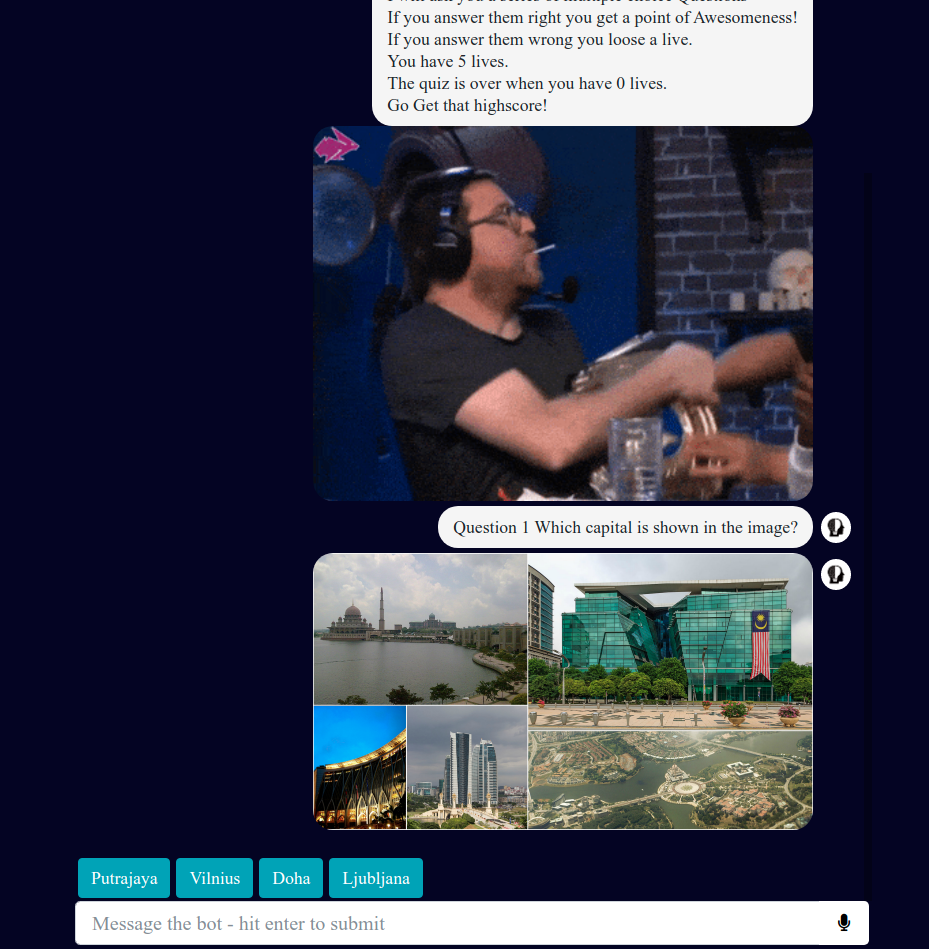

# Quizwire
> chatbot for question answering and endless quizzes using wikidata

Play endless quizzes by asking the bot: <b>"quiz"</b> 
Answer general knowledge questions  
by asking the bot f.e <b>"Who is albert einstein?"</b> 

## Live Demo

https://quizwire.reboting.com/

## Technologies

* [angular 7 with pwa settings](https://angular.io/)
* [express](https://expressjs.com/)
* [dialogflow](https://cloud.google.com/dialogflow/docs/)
* [mongodb](https://www.mongodb.com/)
